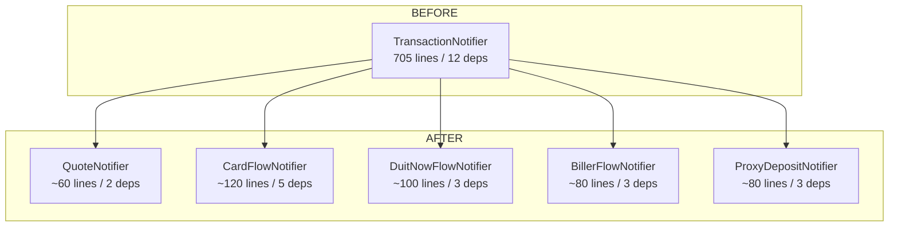

# Revised Design & Implementation Plan: Test Architecture Redesign

## Problem Summary

The current architecture causes a 20-120 minute fix-and-retry loop per BDD scenario change because:
1. [TransactionNotifier](file:///Users/me/myprojects/agentbanking-channel/lib/features/transactions/providers/transaction_provider.dart#87-677) (705 lines, 12 deps) is a God class — every BDD scenario needs all 12 deps mocked
2. [bdd_test_helper.dart](file:///Users/me/myprojects/agentbanking-channel/test/bdd/bdd_test_helper.dart) (359 lines) is a God Object — shared global mocks mean any interface change cascades to all 12 features
3. Unit tests are shallow (pass but don't catch real bugs)
4. No integration test layer exists between unit tests and full-app BDD tests

---

## Phase 1: Break God Classes in Production Code

### Core Principle
Split by **transaction flow type**, not by lifecycle stage. Each notifier owns one complete flow from start to finish with only the dependencies it needs.

### New Notifier Architecture



### File Changes

---

#### `lib/features/transactions/providers/` — Split Notifiers

#### [NEW] [quote_notifier.dart](file:///Users/me/myprojects/agentbanking-channel/lib/features/transactions/providers/quote_notifier.dart)
- **Deps:** `TransactionRepository`, `GeolocatorPlatform`
- **Responsibility:** Validate input (phone, amount caps, geofence), call `getQuote()`, emit `quoting → waitingConsent`
- **Extracts from:** `TransactionNotifier.startTransaction()` lines 122-233

#### [NEW] [card_flow_notifier.dart](file:///Users/me/myprojects/agentbanking-channel/lib/features/transactions/providers/card_flow_notifier.dart)
- **Deps:** `ICardReader`, `IPinPad`, `TransactionRepository`, `FloatNotifier`, `ReversalService`
- **Responsibility:** `waitingCard → waitingPin → processing → success/reversalQueued`
- **Extracts from:** `TransactionNotifier.confirmConsent()` card branch + `processCard()` + `_executeFinal()`

#### [NEW] [duitnow_flow_notifier.dart](file:///Users/me/myprojects/agentbanking-channel/lib/features/transactions/providers/duitnow_flow_notifier.dart)
- **Deps:** `TransactionRepository`, `FloatNotifier`, `ReversalService`
- **Responsibility:** DuitNow transfer polling + QR flow polling
- **Extracts from:** `_executeDuitNowFlow()`, `_executeDuitNowQrFlow()`, `startDuitNowPolling()`

#### [NEW] [biller_flow_notifier.dart](file:///Users/me/myprojects/agentbanking-channel/lib/features/transactions/providers/biller_flow_notifier.dart)
- **Deps:** `TransactionRepository`, `FloatNotifier`  
- **Responsibility:** Bill payment + JomPay polling
- **Extracts from:** `_executeBillerWorkflow()`, `startBillerPolling()`

#### [NEW] [proxy_deposit_notifier.dart](file:///Users/me/myprojects/agentbanking-channel/lib/features/transactions/providers/proxy_deposit_notifier.dart)
- **Deps:** `TransactionRepository`, `IMyKadScanner`
- **Responsibility:** Cash deposit via ProxyEnquiry + MyKad biometric scan
- **Extracts from:** `_executeProxyEnquiryWorkflow()`, `confirmConsent()` cash branch

#### [MODIFY] [transaction_provider.dart](file:///Users/me/myprojects/agentbanking-channel/lib/features/transactions/providers/transaction_provider.dart)
- **Becomes:** Thin orchestrator / backward-compat façade (~80 lines)
- Delegates to the 5 new notifiers based on `serviceCode` and `fundingSource`
- **Preserves:** `TransactionState`, `TransactionStatus` enum, `transactionProvider` provider definition
- **Why façade:** Avoids changing every screen consumer at once; screens can migrate incrementally

---

#### `lib/features/transactions/models/` — Shared State

#### [MODIFY] [transaction_models.dart](file:///Users/me/myprojects/agentbanking-channel/lib/features/transactions/models/transaction_models.dart)
- No structural changes needed — `TransactionState`, `TransactionStatus`, request/response models stay as-is
- Each new notifier uses the *same* `TransactionState` and `TransactionStatus` enum

---

#### `lib/features/merchant/providers/` — Similar Split

> [!NOTE]
> `MerchantNotifier` (351 lines) is smaller and more focused. We'll keep it as-is in Phase 1 but extract the card flow into a shared mixin.

#### [NEW] [card_flow_mixin.dart](file:///Users/me/myprojects/agentbanking-channel/lib/features/transactions/providers/card_flow_mixin.dart)
- Shared card+pin capture logic used by both `CardFlowNotifier` and `MerchantNotifier`
- Eliminates code duplication between the two

---

### Screen Changes

#### [MODIFY] [transaction_flow_screen.dart](file:///Users/me/myprojects/agentbanking-channel/lib/features/transactions/screens/transaction_flow_screen.dart)
- Still watches `transactionProvider` (the façade) — **no immediate UI changes needed**
- The façade orchestrates which sub-notifier handles the flow
- Future: screens can directly watch specific sub-notifiers for even tighter coupling

---

## Phase 2: Add Integration Test Layer

### Purpose
Test each notifier's state machine **directly** — no widget tree, no `pumpBddApp`, no `AgentBankingApp`.

#### [NEW] `test/integration/quote_notifier_test.dart`
```dart
// Example pattern — each test mocks only 2 deps
test('rejects amount > RM 5000', () async {
  final notifier = QuoteNotifier(
    repository: FakeTransactionRepository(),
    geolocator: FakeGeolocator(),
  );
  await notifier.startQuote(Decimal.fromInt(6000), ...);
  expect(notifier.state.status, TransactionStatus.failed);
  expect(notifier.state.error, contains('ERR_VAL_AMOUNT_EXCEEDS_LIMIT'));
});
```

#### [NEW] `test/integration/card_flow_notifier_test.dart`
- Tests: `idle → waitingCard → waitingPin → processing → success`
- Tests: timeout → reversalQueued
- **Deps mocked:** `ICardReader`, `IPinPad`, `TransactionRepository`, `FloatNotifier`, `ReversalService`

#### [NEW] `test/integration/duitnow_flow_notifier_test.dart`
- Tests: proxy transfer polling → success/timeout/failure
- Tests: QR display → polling → success
- **Deps mocked:** `TransactionRepository`, `FloatNotifier`, `ReversalService`

#### [NEW] `test/integration/biller_flow_notifier_test.dart`
- Tests: biller polling → success/timeout
- **Deps mocked:** `TransactionRepository`, `FloatNotifier`

#### [NEW] `test/integration/proxy_deposit_notifier_test.dart`
- Tests: ProxyEnquiry → waitingConsent, MyKad scan for > RM 3,000
- **Deps mocked:** `TransactionRepository`, `IMyKadScanner`

---

## Phase 3: Rebuild BDD Test Infrastructure

### Key Changes

#### [DELETE] `test/bdd/bdd_test_helper.dart` (current God Object)

#### [NEW] `test/bdd/helpers/mock_factory.dart`
- **Factory functions** (not globals) that create fresh mock instances per scenario
- Example: `MockTransactionRepository createMockTransactionRepo({bool shouldFail = false})`

#### [NEW] `test/bdd/helpers/app_harness.dart`
- Replaces `pumpBddApp()` with a **builder pattern**:
```dart
await BddAppHarness(tester)
  .withAuth(authenticated: true)
  .withFloat(balance: Decimal.fromInt(5000))
  .build();
```
- Each `.with*()` adds only the overrides needed
- No more 16-override monolith

#### [NEW] `test/bdd/helpers/feature_helpers/` (per-feature helpers)
- `auth_feature_helper.dart` — overrides only auth + storage
- `payment_feature_helper.dart` — overrides only quote + card notifiers
- `duitnow_feature_helper.dart` — overrides only DuitNow notifier
- Each feature file needs 2-4 overrides instead of 16

#### [MODIFY] `test/bdd/features/step/*.dart` (all 72 step files)
- **Rewrite hollow steps** to test meaningful assertions
- **Fix double-boot**: Background steps set up state; "Given" steps don't re-call `pumpBddApp()`
- Example fix for `the_app_fires_post_apiv1withdrawal.dart`:
  - **Before:** `expect(find.textContaining('Status: success'), findsOneWidget);`
  - **After:** Verify the mock repository's `executeTransaction` was called with correct params

#### [MODIFY] `pubspec.yaml`
- Move `mockito` from `dependencies` to `dev_dependencies`

---

## Dependency Reduction Summary

| Notifier | Before (deps) | After (deps) | Mock Surface |
|---|---|---|---|
| TransactionNotifier | 12 | 2 (façade) | 2 mocks |
| QuoteNotifier | — | 2 | 2 mocks |
| CardFlowNotifier | — | 5 | 5 mocks |
| DuitNowFlowNotifier | — | 3 | 3 mocks |
| BillerFlowNotifier | — | 2 | 2 mocks |
| ProxyDepositNotifier | — | 2 | 2 mocks |
| **BDD per scenario** | **16 overrides** | **2-5 overrides** | **70-80% reduction** |

---

## Verification Plan

### Automated Tests

1. **Integration tests** (Phase 2):
   ```bash
   flutter test test/integration/
   ```
   Each notifier's state machine is tested independently.

2. **BDD tests** (Phase 3):
   ```bash
   flutter test test/bdd/features/
   ```
   All 12 features must pass with the rebuilt infrastructure.

3. **Existing unit tests** (must not regress):
   ```bash
   flutter test test/features/ test/core/
   ```

4. **Static analysis**:
   ```bash
   flutter analyze
   ```

### Manual Verification
- After Phase 1: Run `flutter test` — all existing tests must still pass (façade preserves backward compatibility)
- After Phase 3: Change a `.feature` scenario (e.g., add a step) and verify the fix-and-retry loop takes < 5 minutes instead of 20-120

---

## Execution Order

| Phase | What | Risk | Verification Gate |
|---|---|---|---|
| 1a | Create 5 new notifiers + card_flow_mixin | Low (additive) | New files compile |
| 1b | Convert `TransactionNotifier` to thin façade | Medium (behavioral) | All existing tests pass |  
| 2 | Write integration tests for new notifiers | Low (additive) | Integration tests pass |
| 3a | Create `BddAppHarness` + `mock_factory` | Low (additive) | New helpers compile |
| 3b | Migrate step definitions to use new harness | Medium (high volume) | All BDD scenarios pass |
| 3c | Delete old `bdd_test_helper.dart` | Low (cleanup) | All tests pass |
